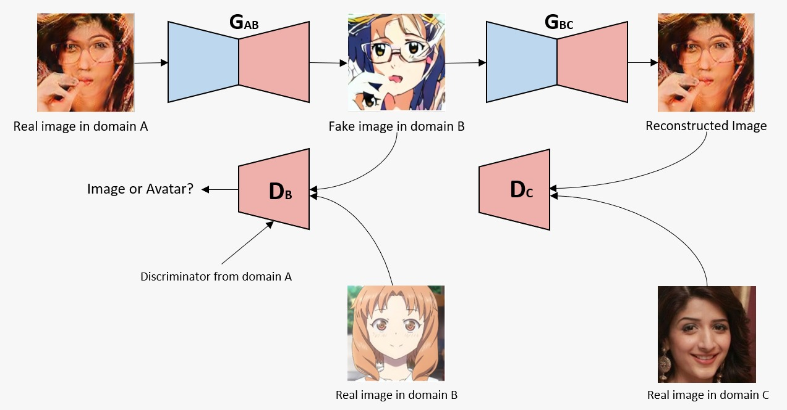

# Pakistani Avatar Generation

```
Group Id: G2F
Basir Mahmood - msds19043@itu.edu.pk
Usama Muneer - msds19077@itu.edu.pk
Muhammad Shafeeq - msds19078@itu.edu.pk
```

## Introduction
Avatar generation is a technique that is of great value in the media industry. And synthetic media is on the rise to make its position in the entertainment industry. GANs are the most important invention of the decade and the prime Architecture for transferring style and texture. The project is converting the image to avatar using UGATIT and we are training to convert the face features to Pakistani faces using CycleGAN. The dataset is of Pakistani faces and is gathered from various sources. With the integrated architecture of UGATIT and CycleGAN, the task will be accomplished on low computable power machine.

## Architecture Diagram



## Dataset

- [selfie2anime](https://meet.google.com/linkredirect?authuser=0&dest=https%3A%2F%2Fdrive.google.com%2Ffile%2Fd%2F1xOWj1UVgp6NKMT3HbPhBbtq2A4EDkghF%2Fview%3Fusp%3Dsharing)
- [Pakistani Faces Images](https://drive.google.com/file/d/1FsDlzvQd59fTMeqQfGxrKOhMe7OEgCA7/view?usp=sharing)

## Results


## References
- [U-GAT-IT — Official TensorFlow Implementation (ICLR 2020)](https://github.com/taki0112/UGATIT)